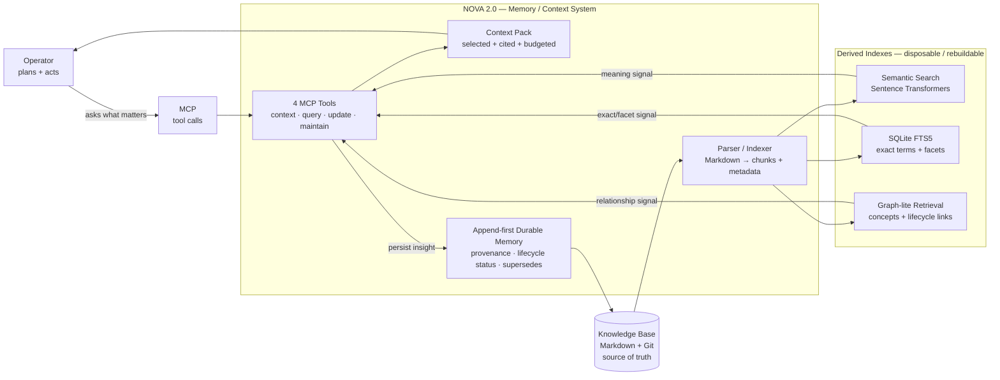

# NOVA 2.0

> Local-first Memory / Context System for agentic work.

NOVA 2.0 is a small, focused context layer. It does not operate, chat, schedule, or execute tasks. It remembers.

The project separates three responsibilities:

```text
Operator        -> plans and acts
Context System  -> retrieves, packages, and persists relevant memory
Knowledge Base  -> stores durable human-readable knowledge
```

NOVA is the **Context System** in that split. It exposes a minimal MCP interface over a Markdown knowledge base so any operator can ask: "What context matters here?" and "Where should this durable insight be stored?"

## Project Vision

Modern AI operators are useful but stateless. They can reason over a task, but they forget decisions, project history, constraints, and source context unless every session is manually reloaded.

NOVA solves that missing layer:

> NOVA turns a local Markdown knowledge base into a structured, searchable, source-attributed memory system.

The goal is not to replace a human-readable vault. The goal is to make that vault useful to operators without dumping the whole thing into a prompt.

## What NOVA Is

- A local-first Memory / Context System
- An MCP server with a deliberately small tool surface
- A bridge between operators and a Markdown Knowledge Base
- A context pack assembler with sources and confidence
- A persistence helper for append-first knowledge updates
- A rebuildable indexing layer over durable files

## What NOVA Is Not

NOVA is not an agent runtime.

It does not own:

- chat sessions
- personas
- cron scheduling
- messaging gateways
- LLM provider configuration
- autonomous planning
- code execution
- project orchestration

Those belong to an operator. NOVA only supplies memory and context.

## Core Concepts

NOVA uses a few deliberately specific terms. Translation table, because architecture words multiply like gremlins after midnight:

| Term | Meaning in NOVA |
|---|---|
| **Operator** | The external agent, CLI, human, or automation that plans and acts. NOVA does not act; it answers memory/context requests. |
| **Memory / Context System** | NOVA's role: retrieve relevant memory, package it into useful context, and persist new durable insights. |
| **Knowledge Base** | The human-readable Markdown vault. This is the source of truth. |
| **MCP** | [Model Context Protocol](https://modelcontextprotocol.io/), the protocol NOVA uses to expose its tools to operators. |
| **Context Pack** | A compact, cited bundle of relevant decisions, constraints, open questions, tasks, facts, and source files for the current query. |
| **Durable Memory** | A knowledge entry worth keeping beyond the current session, stored in Markdown with source/provenance. |
| **Append-first** | NOVA prefers adding a new sourced entry over silently rewriting old knowledge. History stays visible. |
| **Provenance** | Source metadata answering: where did this come from, when was it observed, and how confident is it? |
| **Derived Index** | Rebuildable search/cache data generated from Markdown. Useful, but disposable. Not source truth. |
| **Lifecycle Status** | A memory state such as `active`, `candidate`, `superseded`, `stale`, `archived`, or `rejected`. |
| **Supersedes** | A list of memory IDs that a newer memory replaces. This preserves replacement chains instead of pretending old context vanished. |
| **Facets** | Structured filter values in the SQLite index, e.g. project, memory type, tag, lifecycle status, or superseded memory ID. |

## Search Layer

NOVA combines three search engines behind the memory/query tools:

| Engine | Technology | Upstream / Maintainer | Strength |
|---|---|---|---|
| **Semantic Search** | [Sentence Transformers](https://www.sbert.net/) using `all-MiniLM-L6-v2` | [UKP Lab / Sentence Transformers project](https://www.sbert.net/) | Finds meaning, synonyms, and conceptual similarity |
| **SQLite Full-Text Search** | [SQLite FTS5](https://www.sqlite.org/fts5.html) | [SQLite project](https://www.sqlite.org/) | Finds exact terms, names, IDs, paths, and commands |
| **Graph-lite Retrieval** | NOVA's local graph-lite index over Markdown metadata and memory relations | Internal NOVA component | Finds related concepts, memory types, lifecycle links, and neighborhood evidence |

`hybrid` mode fuses those signals into one ranked result set. Vector search is only one sensor, not the whole brain.

## Technology Stack

| Layer | Technology | Upstream / Vendor |
|---|---|---|
| Runtime | [Python](https://www.python.org/) | [Python Software Foundation](https://www.python.org/psf/) |
| Agent protocol | [Model Context Protocol](https://modelcontextprotocol.io/) | [Anthropic](https://www.anthropic.com/) / MCP project |
| Knowledge format | [Markdown](https://daringfireball.net/projects/markdown/) | [Daring Fireball](https://daringfireball.net/) |
| Versioning | [Git](https://git-scm.com/) | [Git project](https://git-scm.com/) |
| Full-text index | [SQLite FTS5](https://www.sqlite.org/fts5.html) | [SQLite project](https://www.sqlite.org/) |
| Embeddings | [Sentence Transformers](https://www.sbert.net/) | [UKP Lab](https://www.informatik.tu-darmstadt.de/ukp/ukp_home/index.en.jsp) / Sentence Transformers project |
| Tests | [pytest](https://docs.pytest.org/) | [pytest project](https://docs.pytest.org/) |

## Architecture



### Data Flow

```text
Operator query
  -> NOVA MCP tools
  -> Semantic Search + SQLite FTS + Graph-lite Retrieval
  -> ranked matches with citations, facets, lifecycle_status, supersedes
  -> Context Pack for the operator

Knowledge update
  -> append-first Markdown entry with provenance
  -> parser/indexer
  -> semantic_index.json + nova_index.sqlite + graph-lite edges
```

### Source of Truth

The Knowledge Base is the source of truth. Indexes are generated artifacts.

```text
Markdown files -> parser/indexer -> semantic_index.json + nova_index.sqlite + graph-lite edges
```

If an index is deleted, NOVA should be able to rebuild it from the Knowledge Base.

## Tool Surface

NOVA intentionally exposes only four MCP tools:

| Tool | Purpose |
|---|---|
| `nova_context_resolve` | Build a focused context response for a query |
| `nova_knowledge_query` | Search the Knowledge Base semantically |
| `nova_knowledge_update` | Append-first persistence for durable insights |
| `nova_memory_maintain` | Health, validation, and indexing |

Anything beyond this is suspicious until proven useful. Small interface, sharp axe.

## Memory Principles

1. **Markdown first** — humans can read and edit the source.
2. **Indexes are disposable** — generated search data is not source truth.
3. **Provenance required** — useful memory points back to files/sources.
4. **Append before overwrite** — preserve history unless a patch is explicit.
5. **Context is selected** — return the smallest useful context, not the biggest possible dump.
6. **Boundary stays clean** — NOVA remembers; an operator acts.

## Repository Layout

```text
nova/
├── README.md
├── CONTRACTS.md
├── requirements.txt
├── mcp/
│   ├── nova_mcp_core_server.py
│   ├── check_server.py
│   ├── README.md
│   └── tools/
│       ├── common.py
│       ├── context_resolve.py
│       ├── health_checks.py
│       ├── knowledge_query.py
│       ├── knowledge_update.py
│       ├── memory_maintain.py
│       ├── paths.py
│       └── search_shared.py
├── meta/
│   ├── ARCHITECTURE.md
│   ├── PRINCIPLES.md
│   ├── ROADMAP.md
│   └── SYSTEM.md
├── templates/
│   └── knowledge/
└── tests/
```

## Configuration

NOVA reads configuration in this order:

1. Environment variables
2. `nova.toml`
3. Defaults

Common environment variables:

```env
NOVA_CORE_ROOT=/path/to/nova
NOVA_KNOWLEDGE_ROOT=/path/to/nova-knowledge
NOVA_INDEX_ROOT=/path/to/nova/.nova/index
NOVA_SEARCH_ENABLED=true
NOVA_EMBEDDING_MODEL=all-MiniLM-L6-v2
```

## Running the MCP Server

```bash
python mcp/nova_mcp_core_server.py
```

## Maintenance

Run a lightweight local check:

```bash
python mcp/check_server.py
```

Rebuild the memory index through the MCP tool:

```json
{
  "operation": "index",
  "force": false
}
```

## Development

Compile all Python files:

```bash
python -m compileall -q .
```

Run tests with the standard library test runner:

```bash
python -m unittest discover -s tests -v
```

## Design Bias

NOVA should be boring infrastructure: predictable, auditable, local, and small.

If a feature smells like operator behavior, it probably belongs outside NOVA.
