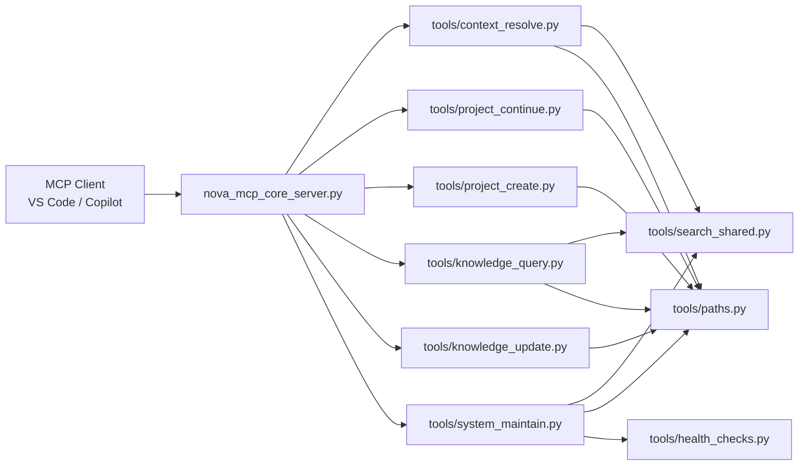
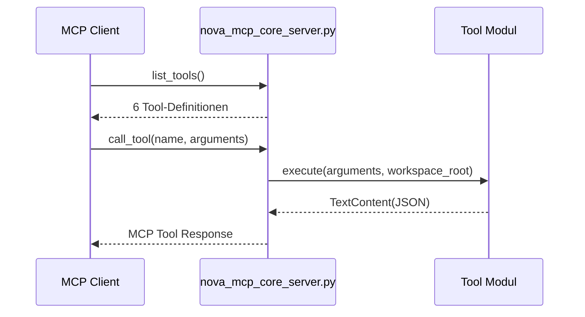
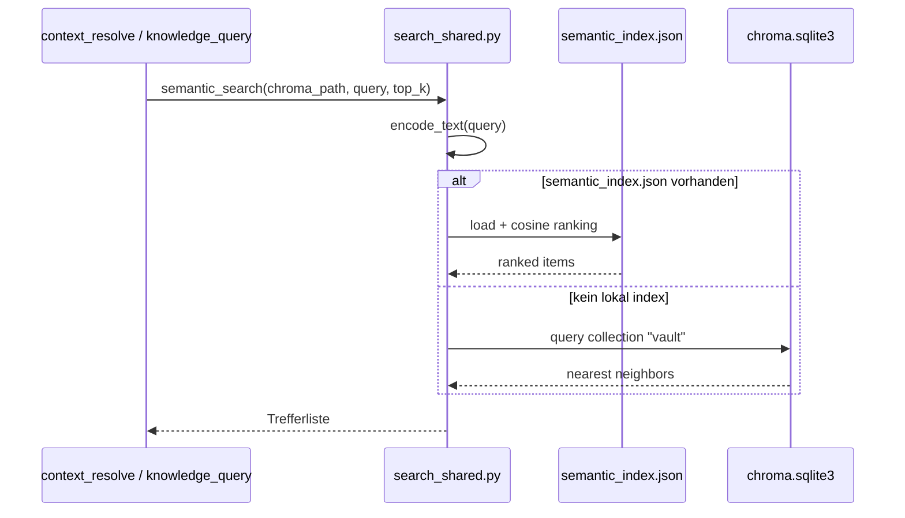
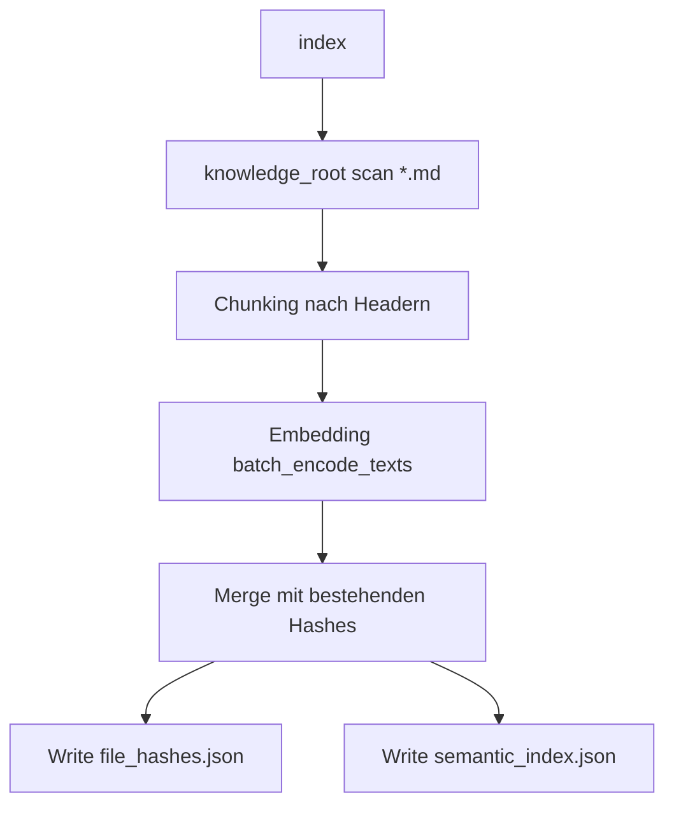

# NOVA MCP Server

Minimaler MCP-Server fuer NOVA v2-Tools.

## Zweck

Dieses Paket stellt genau 6 MCP-Tools bereit:

- `nova_context_resolve`
- `nova_project_continue`
- `nova_project_create`
- `nova_knowledge_query`
- `nova_knowledge_update`
- `nova_system_maintain`

Die Toolflaeche ist absichtlich klein. Legacy-Tools wurden aus der Runtime entfernt.

## Architektur

### Gesamtbild



### Start- und Aufrufpfad



### Semantische Suche und Speicher



### Indexing-Flow (`nova_system_maintain(operation="index")`)



## Verzeichnisstruktur

```text
mcp/
|- nova_mcp_core_server.py
|- requirements.txt
|- README.md
`- tools/
   |- __init__.py
   |- common.py
   |- context_resolve.py
   |- health_checks.py
   |- knowledge_query.py
   |- knowledge_update.py
   |- paths.py
   |- project_continue.py
   |- project_create.py
   |- search_shared.py
   `- system_maintain.py
```

## Laufzeit und Abhaengigkeiten

### Python / Pakete

Installieren:

```bash
cd mcp
pip install -r requirements.txt
```

`requirements.txt`:

- `mcp>=1.0.0`
- `chromadb>=0.4.0`
- `sentence-transformers>=2.2.0`
- `pytest>=7.0.0`
- `pytest-asyncio>=0.21.0`

### Start

```bash
cd mcp
python nova_mcp_core_server.py
```

Beim Start wird standardmaessig das Index-Backend vorgewaermt (`NOVA_PREWARM_INDEX_BACKEND=1`).

## Konfiguration

`tools/paths.py` liest Konfiguration in dieser Prioritaet:

1. Environment Variables
2. `nova.toml`
3. Defaults

### Wichtige ENV Variablen

- `NOVA_CORE_ROOT`
- `NOVA_KNOWLEDGE_ROOT`
- `NOVA_INDEX_ROOT`
- `NOVA_CHROMA_PATH`
- `NOVA_SEARCH_ENABLED` (`true/false`)
- `NOVA_ALLOW_EXTERNAL_PATHS` (`true/false`)
- `NOVA_PREWARM_INDEX_BACKEND` (`1/0`)
- `NOVA_CHROMA_SAFE_QUERY` (`1/0`, optional)

### Pfad-Defaults

- `knowledge_root`: `<workspace>/nova-knowledge`
- `index_root`: `<workspace>/.nova/index`
- `chroma_path`: `<index_root>/chroma`

## Tool API (MCP Surface)

Alle Tools liefern `TextContent` mit JSON-String.

### 1) `nova_context_resolve`

Zweck: Relevanten Arbeitskontext selektiv liefern.

Input:

- `query` (required, string)
- `project_hint` (optional, string)
- `token_budget` (optional, integer, default `1200`)
- `scope` (optional, `string[]`)
- `include_inventory` (optional, bool, default `false`)

Output (Kernfelder):

- `selection_reason: "semantic_search"`
- `confidence`
- `context_items[]` mit `path`, `snippet`, `why_selected`
- `sources[]`
- optional `inventory` (bei `include_inventory=true`)
- bei `query="session init"` zusaetzlich `core_directives`

Funktionsweise:

- Validiert `query`; bei leerem Wert kommt `{"status":"error","message":"query is required"}`.
- Setzt `token_budget` auf mindestens `300` und berechnet `top_k = max(3, min(12, token_budget // 180))`.
- Bricht mit Fehler ab, wenn `search_enabled=false`.
- Ruft `semantic_search(chroma_path, query, top_k * 2)` auf und dedupliziert Treffer pro Pfad.
- Filtert optional per `scope` (Substring-Match auf kleingeschriebenem Pfad).
- Score-Berechnung: `score = max(0.0, 1.0 - distance)`, gerundet auf 4 Stellen.
- Optionaler `project_hint` gibt pro Treffer mit Pfad-Match `+0.05` (gedeckelt auf `0.999`) und sortiert neu.
- Confidence: Mittelwert aller Scores, gedeckelt auf `0.99`, bei leerer Trefferliste `0.0`.
- Bei `include_inventory=true`: kompakte struktur-agnostische Ordneruebersicht.
- Bei `query="session init"`: `core_directives` aus `core/CORE.md` (`hard_rules`, `priorities`, `fallback_policy`).

Beispiel Request:

```json
{
  "query": "session init",
  "project_hint": "nova",
  "token_budget": 1200,
  "scope": ["projects", "internal"],
  "include_inventory": true
}
```

Beispiel Response:

```json
{
  "query": "session init",
  "selection_reason": "semantic_search",
  "confidence": 0.61,
  "core_directives": {
    "status": "ok",
    "hard_rules": ["Context First", "Ask, Don't Assume"],
    "priorities": ["Scope/Sicherheit", "Kernprinzipien"]
  },
  "context_items": [
    {
      "path": "nova-knowledge/projects/internal/nova/CURRENT.md",
      "snippet": "# CURRENT - NOVA ...",
      "why_selected": "semantic_match+project_hint_boost"
    }
  ],
  "sources": [
    {
      "path": "nova-knowledge/projects/internal/nova/CURRENT.md",
      "score": 0.64
    }
  ]
}
```

### 2) `nova_knowledge_query`

Zweck: Semantische Wissensabfrage.

Input:

- `query` (required, string)
- `project` (optional, string)
- `topic` (optional, string)
- `limit` (optional, integer, default `5`)

Output:

- `status`
- `matches[]` mit `path`, `snippet`, `score`, `why_relevant`

Funktionsweise:

- Validiert `query`; bei leerem Wert kommt `{"status":"error","message":"query is required"}`.
- Normalisiert `project` und `topic` auf lowercase und begrenzt `limit` auf `1..20`.
- Bricht mit Fehler ab, wenn `search_enabled=false`.
- Ruft `semantic_search(chroma_path, query, limit * 3)` auf.
- Filtert danach pro Treffer per Pfad-Substring (`project`, `topic`) und dedupliziert pro Pfad.
- Score-Berechnung: `score = max(0.0, 1.0 - distance)`, gerundet auf 4 Stellen.
- Liefert maximal `limit` Treffer mit `why_relevant = "semantic_similarity"`.

Beispiel Request:

```json
{
  "query": "chroma index update",
  "project": "nova",
  "topic": "mcp",
  "limit": 3
}
```

Beispiel Response:

```json
{
  "status": "ok",
  "query": "chroma index update",
  "project": "nova",
  "topic": "mcp",
  "matches": [
    {
      "path": "nova-knowledge/projects/internal/nova/knowledge/2026-02-15-index.md",
      "snippet": "## Index Update ...",
      "score": 0.72,
      "why_relevant": "semantic_similarity"
    }
  ]
}
```

### 3) `nova_knowledge_update`

Zweck: Append-first Persistenz einer Erkenntnis.

Input:

- `content` (required, string)
- `source` (required, string)
- `project` (optional, string)
- `topic` (optional, string)
- `confidence` (optional, number `0.0..1.0`)
- `next_action` (optional, string)

Output:

- `status`
- `written_paths[]`
- `entry_ids[]`

Funktionsweise:

- Pflichtfelder sind `content` und `source` (durch Tool-Schema erzwungen).
- Zielordnerlogik:
- Ohne `project`: bevorzugt existierendes `knowledge/` oder `resources/knowledge/`, sonst `knowledge_root/knowledge`.
- Mit `project`: sucht Verzeichnisse via `rglob("*")` und `slugify(project)`-Substring im Ordnernamen; sortiert nach kuerzerem Pfad, waehlt zuerst den ersten Treffer mit vorhandenem Unterverzeichnis `knowledge/`, sonst den ersten Kandidatenordner selbst.
- `confidence` wird auf `0.0..1.0` geklemmt; ungueltige Werte werden zu `None` (`n/a` im Frontmatter).
- Schreibt immer eine neue Datei `<timestamp>-<topic_slug>.md` mit Frontmatter und optional `## Next Action`.

Beispiel Request:

```json
{
  "content": "Index Laufzeit sinkt nach Chunk-Reuse.",
  "source": "benchmark 2026-02-15",
  "project": "nova",
  "topic": "search",
  "confidence": 0.84,
  "next_action": "Chunk-Size gegenchecken"
}
```

Beispiel Response:

```json
{
  "status": "ok",
  "written_paths": [
    "nova-knowledge/projects/internal/nova/knowledge/20260215-214500-search.md"
  ],
  "entry_ids": [
    "20260215-214500-search"
  ],
  "link_updates": []
}
```

### 4) `nova_project_continue`

Zweck: Projektlagebild + naechste Schritte.

Input:

- `project_hint` (required, string)
- `mode` (optional, enum `continue|status`, default `continue`)

Output:

- `status`
- `project_path`
- `last_steps[]`
- `open_items[]`
- `next_plan[]` (nur bei `continue`)

Funktionsweise:

- Sucht Projektkandidaten rekursiv in `knowledge_root`.
- Kandidat ist ein Ordner mit mindestens einem Signal:
- Datei `CURRENT.md` oder `BACKLOG.md` oder `README.md`, oder mindestens 2 Markdown-Dateien.
- Matching-Scoring fuer `project_hint`:
- Exakter Name (`slug-normalisiert`) = 300
- Teilstring im Ordnernamen = 220
- Teilstring im relativen Pfad = 180
- Fallback: `difflib.get_close_matches(..., cutoff=0.55)`.
- Extrahiert aus bis zu 6 priorisierten Dokumenten (`CURRENT`, `BACKLOG`, `README`, dann alphabetisch):
- `last_steps` aus `- [x] ...`
- `open_items` aus `- [ ] ...`, sonst Fallback auf einfache `- ...` Bullets
- `next_plan` aus nummerierten Listen (`1. ...`) plus offenen Punkten, max 3 Eintraege.
- Bei `mode="status"` wird `next_plan` leer zurueckgegeben.

Beispiel Request:

```json
{
  "project_hint": "nova",
  "mode": "continue"
}
```

Beispiel Response:

```json
{
  "project_hint": "nova",
  "status": "ok",
  "mode": "continue",
  "project_path": "nova-knowledge/projects/internal/nova",
  "last_steps": [
    "MCP Tool Surface bereinigt"
  ],
  "open_items": [
    "README mit API-Beispielen erweitern"
  ],
  "next_plan": [
    "Doku finalisieren",
    "Tooltest ausfuehren",
    "CURRENT aktualisieren"
  ]
}
```

### 5) `nova_project_create`

Zweck: Neues Projekt bootstrapen.

Input:

- `customer` (required, string)
- `project_name` (required, string)
- `template` (optional, string, default `default`)
- `initial_context` (optional, string)
- `target_root` (optional, string)

Output:

- `status`
- `project_path`
- `created_paths[]`
- `bootstrap_files[]`
- `next_actions[]`

Funktionsweise:

- Basisordner:
- Mit `target_root`: `knowledge_root / target_root`
- Sonst Heuristik in Reihenfolge: `projects`, `kunden`, `workspaces`, `areas`, sonst Default `knowledge_root/projects`.
- Zielpfad: `<base>/<slug(customer)>/<slug(project_name)>`.
- Wenn Projektordner schon existiert: Rueckgabe `status="exists"` ohne Ueberschreiben.
- Legt `project_root` und `project_root/knowledge` an.
- Schreibt `README.md`, `CURRENT.md`, `BACKLOG.md` nur, wenn Datei noch nicht existiert (`_write_if_missing`).

Beispiel Request:

```json
{
  "customer": "internal",
  "project_name": "mcp cleanup",
  "template": "default",
  "initial_context": "Toolstruktur vereinfachen",
  "target_root": "projects"
}
```

Beispiel Response:

```json
{
  "status": "ok",
  "project_path": "nova-knowledge/projects/internal/mcp-cleanup",
  "created_paths": [
    "nova-knowledge/projects/internal/mcp-cleanup",
    "nova-knowledge/projects/internal/mcp-cleanup/knowledge"
  ],
  "bootstrap_files": [
    "nova-knowledge/projects/internal/mcp-cleanup/README.md",
    "nova-knowledge/projects/internal/mcp-cleanup/CURRENT.md",
    "nova-knowledge/projects/internal/mcp-cleanup/BACKLOG.md"
  ],
  "next_actions": [
    "Projektziel in README.md schaerfen.",
    "CURRENT.md mit konkreten Tasks aktualisieren.",
    "Erste Erkenntnisse via nova_knowledge_update persistieren."
  ]
}
```

### 6) `nova_system_maintain`

Zweck: Betriebsfunktionen.

Input:

- `operation` (required, enum `health|index|restart`)
- `force` (optional, bool; nur fuer `index`)
- `delay_seconds` (optional, int; nur fuer `restart`, Bereich `1..30`)

Output:

- `operation=health`: gruppierte Health Summary
- `operation=index`: Index-Metriken (`changed_files`, `total_chunks`, ...)
- `operation=restart`: geplanter Self-Terminate-Delay

Funktionsweise:

- `health`: ruft `run_grouped_checks()` auf und formatiert die Ausgabe mit `format_grouped_simple()`.
- `index`:
- Initialisiert zuerst Embedding-Backend (`batch_encode_texts(["warmup"])`), optional `force_reload`.
- Scannt `knowledge_root` rekursiv nach `*.md`.
- Chunkt Inhalte per Header-Split (`#`/`##`) und begrenzt jeden Chunk auf 2000 Zeichen.
- Nutzt inkrementelles Hashing via `file_hashes.json` (MD5 pro Datei), außer bei `force=true`.
- Erzeugt/aktualisiert `semantic_index.json` mit Embeddings pro Chunk.
- Entfernt geloeschte Dateien aus Hash- und Index-Struktur.
- `restart`: startet `threading.Timer` und beendet den Prozess via `os._exit(0)` nach `delay_seconds` (geklemmt auf 1..30).
- Unerlaubte Operationen liefern `{"status":"error","details":{"message":"Unsupported operation. Allowed: health, index, restart"}}`.

Beispiel Request (`health`):

```json
{
  "operation": "health"
}
```

Beispiel Response (`health`):

```json
{
  "status": "ok",
  "operation": "health",
  "details": {
    "summary": "[OK] **CORE:** MCP Tools 6 Tools | Python 3.13 | Core Files 3 vorhanden"
  },
  "artifacts": []
}
```

Beispiel Request (`index`):

```json
{
  "operation": "index",
  "force": false
}
```

Beispiel Response (`index`):

```json
{
  "status": "ok",
  "operation": "index",
  "details": {
    "force": false,
    "changed_files": 12,
    "unchanged_files": 274,
    "deleted_files": 1,
    "total_files": 286,
    "total_chunks": 1640,
    "index_file": "E:/Dev/NOVA/.nova/index/semantic_index.json"
  },
  "artifacts": []
}
```

Hinweis: `operation="test"` ist bewusst nicht Teil der API.

## Semantischer Speicher: Was wird genutzt?

Ja, der semantische Speicher wird genutzt.

- Die Suche laeuft ueber `tools/search_shared.py`.
- Primar nutzt der Code `semantic_index.json` (falls vorhanden) fuer Ranking.
- Falls nicht vorhanden, wird auf Chroma Collection `vault` via `chroma.sqlite3` gegangen.

## Health Checks

`health_checks.py` liefert 5 Gruppen:

- `CORE`
- `VAULT`
- `SEARCH`
- `CONTENT`
- `TODAY`

Diese Summary wird von `nova_system_maintain(operation="health")` ausgegeben.

## Typische Betriebsablaeufe

### Initialer Betrieb

1. `nova_system_maintain(operation="health")`
2. `nova_system_maintain(operation="index", force=false)`
3. `nova_context_resolve(query="session init", include_inventory=true)`

### Nach grossen Content-Aenderungen

1. `nova_system_maintain(operation="index", force=true)`
2. `nova_knowledge_query(query="...")`

## Policy zu Tool-Mapping

- Start/Regeln/Inventar: `nova_context_resolve(query="session init", include_inventory=true)`
- Projektstatus/Weiterarbeiten: `nova_project_continue(project_hint, mode)`
- Persistenz von Erkenntnissen/Entscheidungen/Risiken: `nova_knowledge_update(...)`
- Offene Fragen/Suche: `nova_knowledge_query(...)`
- Betriebszustand: `nova_system_maintain(operation="health")`

Empfohlener Persistenz-Flow (`auto_with_confirm`):
1. Arbeitsblock abgeschlossen oder Erkenntnis erkannt.
2. Kurze Rueckfrage: `Soll ich das jetzt persistieren?`
3. Bei Zustimmung: `nova_knowledge_update(...)`.
4. Danach kurze Review-Ausgabe (`done/persisted/next`), nur wenn geschrieben wurde.

## Fehlerbilder / Troubleshooting

### Semantische Suche deaktiviert

Symptom: Tool liefert `search_enabled=false` Fehler.

Pruefen:

- `NOVA_SEARCH_ENABLED`
- `nova.toml [search].enabled`

### Embedding/Model Fehler

Symptom: `Embedding fehlgeschlagen ... sentence-transformers`.

Pruefen:

- `pip install -r mcp/requirements.txt`
- Python Environment des MCP Servers

### Chroma Runtime auf Windows/Python 3.13

`search_shared.py` enthaelt Schutz fuer bekannte Instabilitaeten.
Falls noetig, Safe-Query Verhalten ueber `NOVA_CHROMA_SAFE_QUERY` steuern.

### Tool-Schema wirkt veraltet

Nach Tool-Aenderungen MCP Host/Server neu starten, damit `list_tools` neu geladen wird.

## Entwicklungsnotizen

- Keine Fallback-Alttools im MCP Surface.
- Fokus auf klaren, wartbaren Kern.
- Erweiterungen nur, wenn sie zur Kern-Toolflaeche passen.
