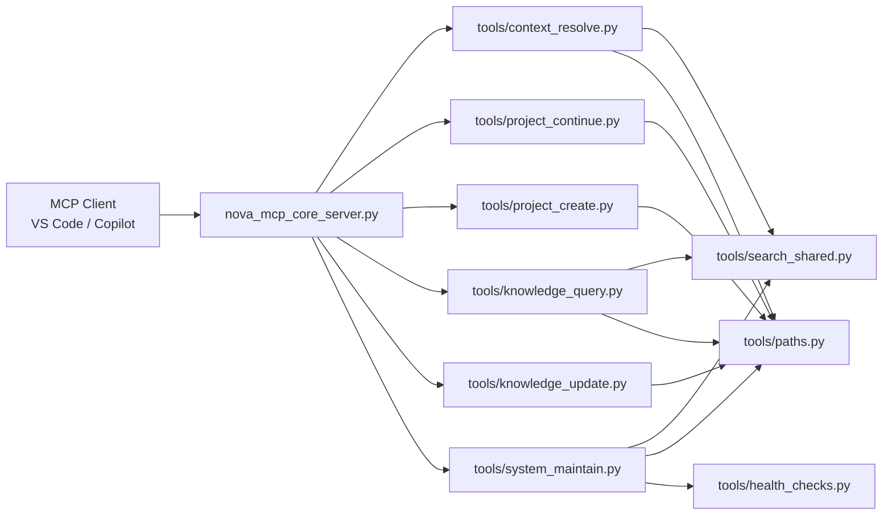
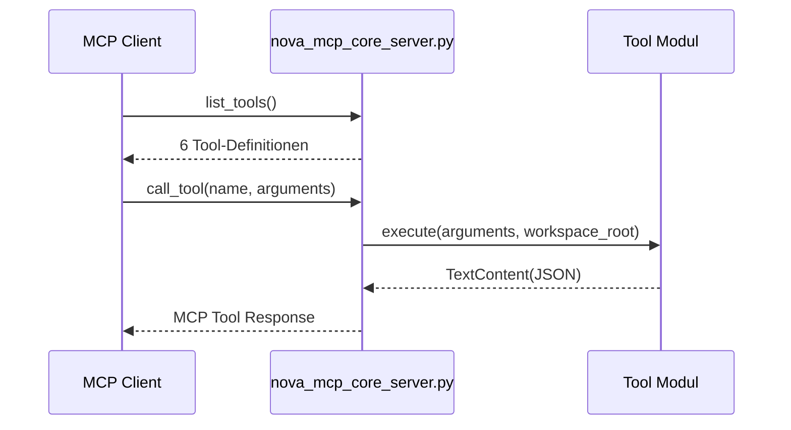
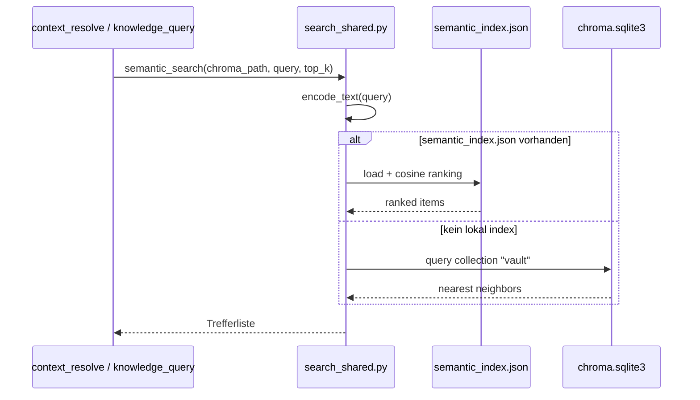
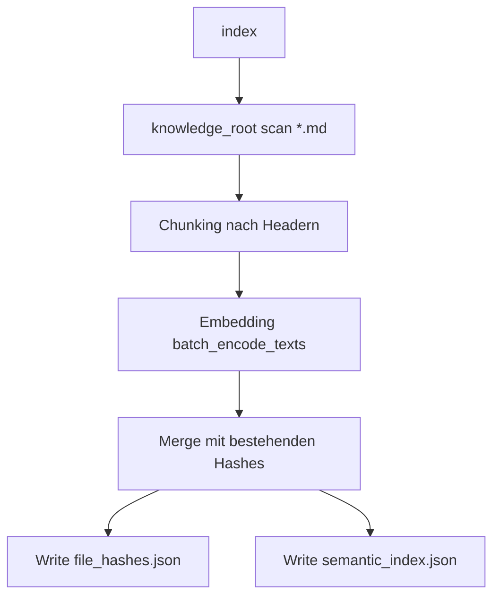

# NOVA MCP Server

Minimaler MCP-Server fuer NOVA v2-Tools.

## Zweck

Dieses Paket stellt genau 6 MCP-Tools bereit:

- `nova_context_resolve`
- `nova_project_continue`
- `nova_project_create`
- `nova_knowledge_query`
- `nova_knowledge_update`
- `nova_system_maintain`

Die Toolflaeche ist absichtlich klein. Legacy-Tools wurden aus der Runtime entfernt.

## Architektur

### Gesamtbild



### Start- und Aufrufpfad



### Semantische Suche und Speicher



### Indexing-Flow (`nova_system_maintain(operation="index")`)



## Verzeichnisstruktur

```text
mcp/
|- nova_mcp_core_server.py
|- requirements.txt
|- README.md
`- tools/
   |- __init__.py
   |- common.py
   |- context_resolve.py
   |- health_checks.py
   |- knowledge_query.py
   |- knowledge_update.py
   |- paths.py
   |- project_continue.py
   |- project_create.py
   |- search_shared.py
   `- system_maintain.py
```

## Laufzeit und Abhaengigkeiten

### Python / Pakete

Installieren:

```bash
cd mcp
pip install -r requirements.txt
```

`requirements.txt`:

- `mcp>=1.0.0`
- `chromadb>=0.4.0`
- `sentence-transformers>=2.2.0`
- `pytest>=7.0.0`
- `pytest-asyncio>=0.21.0`

### Start

```bash
cd mcp
python nova_mcp_core_server.py
```

Beim Start wird standardmaessig das Index-Backend vorgewaermt (`NOVA_PREWARM_INDEX_BACKEND=1`).

## Konfiguration

`tools/paths.py` liest Konfiguration in dieser Prioritaet:

1. Environment Variables
2. `nova.toml`
3. Defaults

### Wichtige ENV Variablen

- `NOVA_CORE_ROOT`
- `NOVA_KNOWLEDGE_ROOT`
- `NOVA_INDEX_ROOT`
- `NOVA_CHROMA_PATH`
- `NOVA_SEARCH_ENABLED` (`true/false`)
- `NOVA_ALLOW_EXTERNAL_PATHS` (`true/false`)
- `NOVA_PREWARM_INDEX_BACKEND` (`1/0`)
- `NOVA_CHROMA_SAFE_QUERY` (`1/0`, optional)

### Pfad-Defaults

- `knowledge_root`: `<workspace>/nova-knowledge`
- `index_root`: `<workspace>/.nova/index`
- `chroma_path`: `<index_root>/chroma`

## Tool API (MCP Surface)

Alle Tools liefern `TextContent` mit JSON-String.

### 1) `nova_context_resolve`

Zweck: Relevanten Arbeitskontext selektiv liefern.

Input:

- `query` (required, string)
- `project_hint` (optional, string)
- `token_budget` (optional, integer, default `1200`)
- `scope` (optional, `string[]`)

Output (Kernfelder):

- `selection_reason: "semantic_search"`
- `confidence`
- `context_items[]` mit `path`, `snippet`, `why_selected`
- `sources[]`

Funktionsweise:

- Liest Konfiguration ueber `tools/paths.py`.
- Ermittelt `top_k` dynamisch aus `token_budget`.
- Fuehrt semantische Suche ueber `tools/search_shared.py` aus.
- Dedupliziert Treffer auf Dateipfad-Ebene und berechnet Scores aus Distanzwerten.
- Optionaler `project_hint` erhoeht Score bei Pfad-Match.

### 2) `nova_knowledge_query`

Zweck: Semantische Wissensabfrage.

Input:

- `query` (required, string)
- `project` (optional, string)
- `topic` (optional, string)
- `limit` (optional, integer, default `5`)

Output:

- `status`
- `matches[]` mit `path`, `snippet`, `score`, `why_relevant`

Funktionsweise:

- Nutzt dieselbe semantische Retrieval-Pipeline wie `nova_context_resolve`.
- Holt mehr Kandidaten (`limit * 3`) und filtert dann nach `project`/`topic` (Substring auf Pfad).
- Dedupliziert pro Pfad und begrenzt auf `limit`.

### 3) `nova_knowledge_update`

Zweck: Append-first Persistenz einer Erkenntnis.

Input:

- `content` (required, string)
- `source` (required, string)
- `project` (optional, string)
- `topic` (optional, string)
- `confidence` (optional, number `0.0..1.0`)
- `next_action` (optional, string)

Output:

- `status`
- `written_paths[]`
- `entry_ids[]`

Funktionsweise:

- Ermittelt Zielordner struktur-agnostisch (bevorzugt vorhandene `knowledge`-Orte).
- Schreibt pro Eintrag eine neue Markdown-Datei mit Frontmatter (`source`, `project`, `topic`, `confidence`, `date`).
- Dateiname basiert auf Zeitstempel + Topic-Slug.

### 4) `nova_project_continue`

Zweck: Projektlagebild + naechste Schritte.

Input:

- `project_hint` (required, string)
- `mode` (optional, enum `continue|status`, default `continue`)

Output:

- `status`
- `project_path`
- `last_steps[]`
- `open_items[]`
- `next_plan[]` (nur bei `continue`)

Funktionsweise:

- Sucht Projektordner struktur-agnostisch in `knowledge_root`.
- Match-Logik: exakter Name > Teilstring > unscharfer Match.
- Extrahiert erledigte/offene Aufgaben aus Markdown (Checkboxen, nummerierte Listen).
- Baut daraus Statusbild und optional 3-Schritt-Plan.

### 5) `nova_project_create`

Zweck: Neues Projekt bootstrapen.

Input:

- `customer` (required, string)
- `project_name` (required, string)
- `template` (optional, string, default `default`)
- `initial_context` (optional, string)
- `target_root` (optional, string)

Output:

- `status`
- `project_path`
- `created_paths[]`
- `bootstrap_files[]`
- `next_actions[]`

Funktionsweise:

- Ermittelt Basisordner heuristisch (`projects`, `kunden`, `workspaces`, `areas`) oder nutzt `target_root`.
- Legt Projektstruktur inkl. `knowledge/` an.
- Bootstrappt `README.md`, `CURRENT.md`, `BACKLOG.md`, falls noch nicht vorhanden.

### 6) `nova_system_maintain`

Zweck: Betriebsfunktionen.

Input:

- `operation` (required, enum `health|index|restart`)
- `force` (optional, bool; nur fuer `index`)
- `delay_seconds` (optional, int; nur fuer `restart`, Bereich `1..30`)

Output:

- `operation=health`: gruppierte Health Summary
- `operation=index`: Index-Metriken (`changed_files`, `total_chunks`, ...)
- `operation=restart`: geplanter Self-Terminate-Delay

Funktionsweise:

- `health`: ruft `tools/health_checks.py` auf und liefert gruppierte Summary.
- `index`: scannt Markdown-Dateien, chunked nach Headern, erzeugt Embeddings und schreibt `semantic_index.json` + `file_hashes.json`.
- `restart`: startet verzögerten Self-Terminate-Timer (`delay_seconds` 1..30).

Hinweis: `operation="test"` ist bewusst nicht Teil der API.

## Semantischer Speicher: Was wird genutzt?

Ja, der semantische Speicher wird genutzt.

- Die Suche laeuft ueber `tools/search_shared.py`.
- Primar nutzt der Code `semantic_index.json` (falls vorhanden) fuer Ranking.
- Falls nicht vorhanden, wird auf Chroma Collection `vault` via `chroma.sqlite3` gegangen.

## Health Checks

`health_checks.py` liefert 5 Gruppen:

- `CORE`
- `VAULT`
- `SEARCH`
- `CONTENT`
- `TODAY`

Diese Summary wird von `nova_system_maintain(operation="health")` ausgegeben.

## Typische Betriebsablaeufe

### Initialer Betrieb

1. `nova_system_maintain(operation="health")`
2. `nova_system_maintain(operation="index", force=false)`
3. `nova_context_resolve(query="session init")`

### Nach grossen Content-Aenderungen

1. `nova_system_maintain(operation="index", force=true)`
2. `nova_knowledge_query(query="...")`

## Fehlerbilder / Troubleshooting

### Semantische Suche deaktiviert

Symptom: Tool liefert `search_enabled=false` Fehler.

Pruefen:

- `NOVA_SEARCH_ENABLED`
- `nova.toml [search].enabled`

### Embedding/Model Fehler

Symptom: `Embedding fehlgeschlagen ... sentence-transformers`.

Pruefen:

- `pip install -r mcp/requirements.txt`
- Python Environment des MCP Servers

### Chroma Runtime auf Windows/Python 3.13

`search_shared.py` enthaelt Schutz fuer bekannte Instabilitaeten.
Falls noetig, Safe-Query Verhalten ueber `NOVA_CHROMA_SAFE_QUERY` steuern.

### Tool-Schema wirkt veraltet

Nach Tool-Aenderungen MCP Host/Server neu starten, damit `list_tools` neu geladen wird.

## Entwicklungsnotizen

- Keine Fallback-Alttools im MCP Surface.
- Fokus auf klaren, wartbaren Kern.
- Erweiterungen nur, wenn sie zur Kern-Toolflaeche passen.
