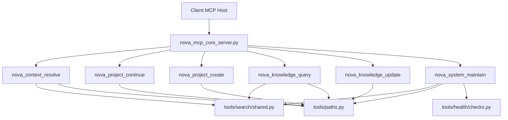
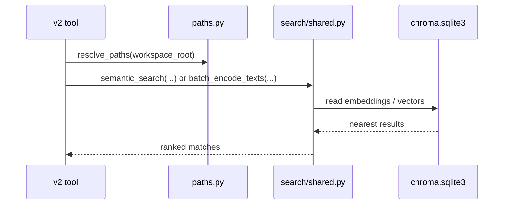

# NOVA MCP Server

MCP server for NOVA v2 tools.

## Scope

This MCP package currently exposes only v2 tools from `mcp/tools/v2`.
Legacy adapters in `mcp/tools/*` (context/git/n8n/sessions/testing/worklog/old search) were removed from runtime surface.

## Exposed Tools

| Tool | Purpose |
|---|---|
| `nova_context_resolve` | Resolve relevant working context via semantic retrieval |
| `nova_project_continue` | Continue a project with status and next steps |
| `nova_project_create` | Create a structured NOVA project scaffold |
| `nova_knowledge_query` | Semantic knowledge query |
| `nova_knowledge_update` | Append-first persistence of new knowledge |
| `nova_system_maintain` | Operations: `health`, `index`, `restart` |

## Runtime Structure

```text
mcp/
|- nova_mcp_core_server.py
|- README.md
`- tools/
   |- __init__.py
   |- paths.py
   |- health/
   |  |- __init__.py
   |  `- checks.py
   |- search/
   |  |- __init__.py
   |  `- shared.py
   `- v2/
      |- __init__.py
      |- common.py
      |- context_resolve.py
      |- knowledge_query.py
      |- knowledge_update.py
      |- project_continue.py
      |- project_create.py
      `- system_maintain.py
```

## Architecture Diagram



## Semantic Retrieval/Data Flow



## Operations (`nova_system_maintain`)

- `health`: grouped runtime checks
- `index`: rebuild/update semantic index artifacts
- `restart`: delayed self-terminate for MCP restart handoff

`test` is not part of `nova_system_maintain`.

## Notes

- `tools/search/shared.py` is the shared semantic layer used by `nova_context_resolve`, `nova_knowledge_query`, and indexing paths.
- MCP server restart is required after schema or tool-surface changes.
